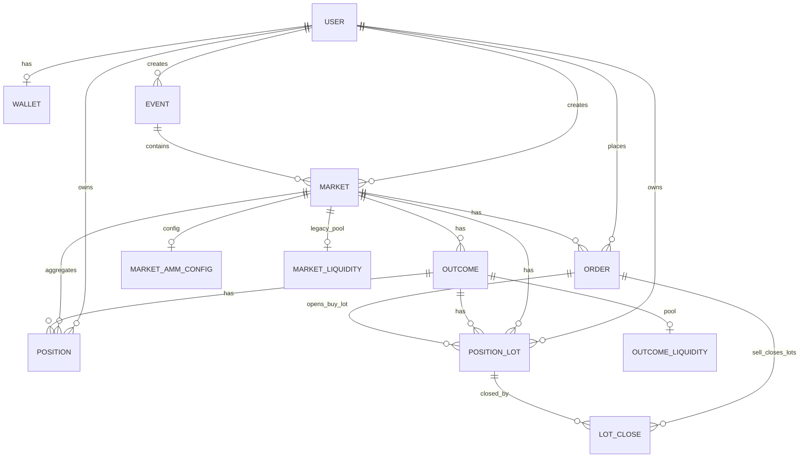

# Polipmarket adatmodell (ER áttekintés)

# https://mermaidviewer.com/editor

## Rövid értelmezés

- **Event → Market**: egy event alatt több market lehet.
- **Market → Outcome**: egy market alatt több outcome lehet (nem csak 1).
- **Order.position (YES/NO)**: a YES/NO nem külön tábla, hanem enum mező (`OrderPosition`) több táblában (`Order`, `Position`, `PositionLot`).
- **Position**: user aggregált pozíciója market+outcome+YES/NO szinten.
- **PositionLot**: BUY-onként nyitott lot (lot-szintű nyilvántartás).
- **LotClose**: SELL műveletek, amelyek konkrét buy lotokat zárnak részben/egészben.

Megjegyzés: a rendszerben megtalálható `MarketLiquidity` (market szintű), de az aktív AMM-logikában az `OutcomeLiquidity` + `MarketAmmConfig` a meghatározó.
